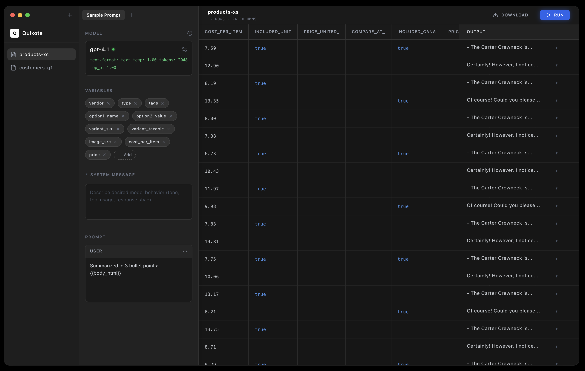
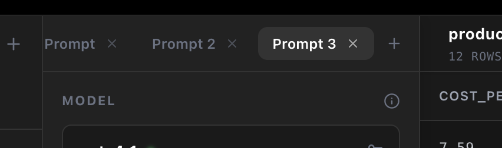

<p align="center">
  
</p>

# Quixote

Native macOS app for testing LLM prompts on local structured data.

[Direct Download](https://github.com/c0/quixote/releases/download/v1.0.6/Quixote-1.0.6.dmg) | [Website](https://c0.github.io/quixote/) | [Releases](https://github.com/c0/quixote/releases)


Import a CSV, TSV, JSON, or XLSX file, write prompts with row variables, run those prompts across one or more LLM providers, inspect outputs and raw responses, then export the enriched table.

```text
products.csv / customers.xlsx / data.json
        |
        v
+-------------------+
| Local data table  |
| rows + variables  |
+-------------------+
     |        |        |
     v        v        v
Prompt A  Prompt B  Prompt C
     |        |        |
     v        v        v
Model(s)  Model(s)  Model(s)
     |        |        |
     +--------+--------+
              v
Enriched result columns + stats + CSV export
```

## Features

### Data

- **Local files** - Open CSV, TSV, tab-delimited, JSON, and XLSX files.
- **Delimiter detection** - CSV parsing detects comma, tab, semicolon, and pipe-delimited files.
- **Excel import** - XLSX support reads the first worksheet and treats the first row as headers.
- **JSON import** - JSON support reads top-level arrays of objects.
- **Change detection** - File content is hashed so changed files can be re-run intentionally.

### Prompting

- **Multiple prompts per file** - Keep several prompt tabs attached to the same dataset.
- **Row variables** - Insert file columns into prompts and system messages with variable interpolation.
- **Model parameters** - Configure temperature, max tokens, top-p, and reasoning effort where supported.
- **Run limits** - Run all rows or quick samples like first 10, 100, or 1000 rows.

### Providers

- **Built-in providers** - OpenAI, Gemini, Ollama, and LM Studio.
- **Custom APIs** - Connect any OpenAI-compatible endpoint with a custom base URL.
- **Model refresh** - Pull model lists from providers that expose `/v1/models`.
- **Manual models** - Add model IDs manually for local or custom providers when model listing is unavailable.

### Runs & Results

- **Concurrent processing** - Run rows with configurable concurrency and rate limits.
- **Pause and resume** - Pause active work and restore queued runs from disk.
- **Retry failed outputs** - Retry all failures or a selected failed output.
- **Output detail** - Inspect content, raw provider responses, status, tokens, cost, latency, similarity, and ROUGE.
- **Copy output** - Copy content or raw response from the detail sidebar.

### Stats & Export

- **Run stats** - Track progress, throughput, latency, token usage, and cost.
- **Per-model stats** - Compare model performance and quality metrics.
- **Similarity metrics** - Optional cosine similarity and ROUGE-1/2/L metrics.
- **Caching** - Identical requests can reuse persisted cached responses instead of calling the provider again.
- **CSV export** - Export original columns plus prompt output and selected metrics.

### Privacy

- **Local-first data** - Source files are read locally by the app.
- **Keychain secrets** - API keys are stored in the macOS Keychain.
- **Local providers** - Ollama and LM Studio can run without API keys on local OpenAI-compatible endpoints.

## Screenshots





## Screenshot Demo Data

For product screenshots, use `samples/seo-products.csv` with the prompts in `samples/seo-humanize-prompts.md`. The sample dataset is an ecommerce catalog for generating humanized SEO descriptions, SEO titles, and meta descriptions.

Use `samples/seo-provider-models.csv` as a reference list for provider/model cards in screenshots: OpenAI, Gemini, Ollama, LM Studio, and custom OpenAI-compatible APIs.

## Prerequisites

- **macOS 14** (Sonoma) or later.
- **Xcode** with command-line tools.
- **Homebrew** ([brew.sh](https://brew.sh)).
- **XcodeGen** (`brew install xcodegen`, or `make setup`).

Swift packages are resolved by Xcode. The marketing site uses Astro and Node dependencies under `site/`.

## Quick Start

```sh
git clone https://github.com/c0/quixote.git
cd quixote

make setup      # install xcodegen once
make generate   # generate Quixote.xcodeproj from project.yml
make dev        # build and launch the debug app
```

The Xcode project is generated from `project.yml`. If you change `project.yml`, run `make generate` again. Do not edit generated project settings by hand unless you intend to regenerate and preserve the change in `project.yml`.

### Command-line build

```sh
make build
```

### Site

```sh
make site-dev    # run the Astro site locally
make site-build  # build the site
```

## Project Structure

```text
Quixote/
+-- Quixote/          # Swift app source
|   +-- Models/       # Codable models, providers, run/result types
|   +-- Parsers/      # CSV, JSON, and XLSX import
|   +-- Protocols/    # File parser and LLM service interfaces
|   +-- Services/     # OpenAI-compatible service, cache, keychain, rate limiting
|   +-- ViewModels/   # Workspace, prompts, settings, processing, results, stats
|   +-- Views/        # SwiftUI/AppKit macOS UI
+-- site/             # Astro landing page and appcast assets
+-- assets/           # App icon, design system assets, screenshots
+-- docs/design/      # Design references
+-- scripts/          # Release pipeline
+-- project.yml       # XcodeGen source of truth
+-- Makefile          # Common dev and release commands
```

## Architecture

Quixote is a SwiftUI macOS app with focused AppKit bridges where native macOS behavior is needed. Workspace state, prompt editing, provider settings, processing, results, stats, and export are split into view models.

The processing pipeline parses a local table into rows and columns, expands each prompt against each row, sends requests through an OpenAI-compatible provider adapter, persists completed results, caches equivalent responses, and updates the table, detail sidebar, stats panel, and CSV export.

The direct-download build uses Sparkle for updates. The public site is an Astro project that serves the download page, social metadata, and Sparkle appcast.

## Dependencies

| Package | Purpose |
| --- | --- |
| [Sparkle](https://sparkle-project.org) | Direct-download app updates |
| [CoreXLSX](https://github.com/CoreOffice/CoreXLSX) | XLSX parsing |
| [Astro](https://astro.build) | Static marketing site |
| [XcodeGen](https://github.com/yonaskolb/XcodeGen) | Generates `Quixote.xcodeproj` from `project.yml` |

Quixote also uses Apple frameworks including SwiftUI, AppKit, Foundation, CryptoKit, UniformTypeIdentifiers, and Security/Keychain APIs.

## Common Dev Tasks

### Add or change providers

Update provider defaults and model identity behavior in the model layer, then route requests through the OpenAI-compatible service. Provider settings should preserve API keys in Keychain and keep provider profile IDs in result/cache identity.

### Add a file parser

Add a parser under `Quixote/Parsers/`, conform it to `FileParser`, and make sure rows preserve stable column names and row ordering for prompt interpolation and exports.

### Update UI styling

Shared colors, spacing, and button styles live in `Quixote/Views/QuixoteTheme.swift`. Design references live under `assets/design-system/` and `docs/design/`.

### Update the site

Edit Astro files under `site/`, then run:

```sh
make site-build
```

### Release

The release script bumps the app version, archives, exports, creates a DMG, notarizes, staples, updates the Sparkle appcast, commits release metadata, tags, pushes, creates a GitHub Release, and verifies the Pages deploy.

```sh
make release VERSION=x.y.z
```
