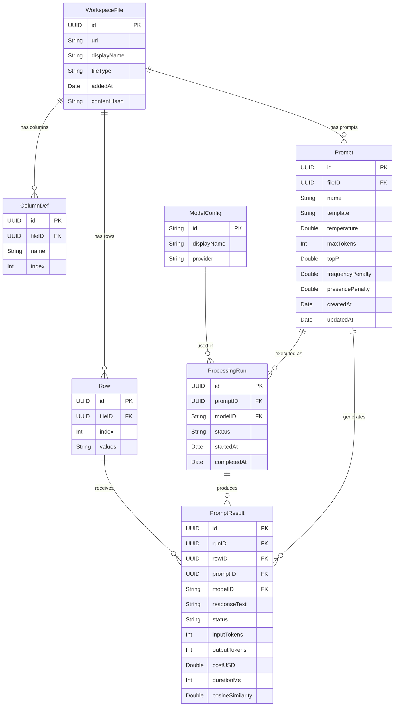
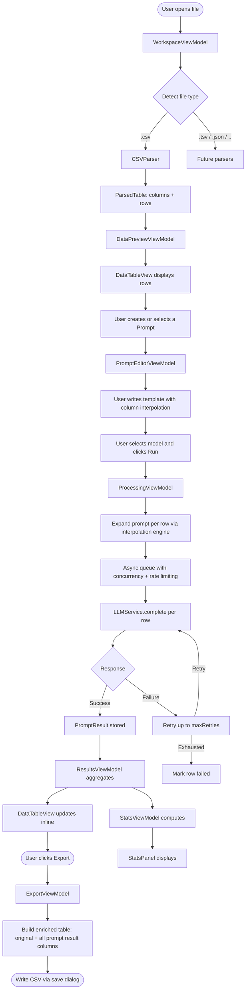

# Quixote — Functional Specification

> A fast, keyboard-driven macOS desktop tool for enriching structured data files with LLMs.

---

## Table of Contents

1. [Product Overview](#1-product-overview)
2. [Architecture (MVVM)](#2-architecture-mvvm)
3. [Data Model](#3-data-model)
4. [Data Flow](#4-data-flow)
5. [Critical Path](#5-critical-path)
6. [Build Execution Order](#6-build-execution-order)
7. [File Management & Parsing](#7-file-management--parsing)
8. [Data Preview](#8-data-preview)
9. [Prompt Authoring](#9-prompt-authoring)
10. [Model Selection](#10-model-selection)
11. [Processing & Queue](#11-processing--queue)
12. [Results & Output](#12-results--output)
13. [Statistics](#13-statistics)
14. [Export](#14-export)
15. [Settings](#15-settings)

---

## 1. Product Overview

Quixote lets users open a structured data file, send each row to one or more LLMs using one or more prompt templates, see the results inline, and export the enriched output. The app is designed for bulk, iterative prompt exploration: running the same data through different prompts or models, inspecting results, adjusting, and re-running.

The core loop is:

1. Open a file (CSV to start; extensible to any tabular format).
2. Write one or more prompts that reference column values.
3. Select one or more models.
4. Run — the app processes every row in the background.
5. Export the enriched file.

---

## 2. Architecture (MVVM)

The app follows strict MVVM. Views hold no business logic. ViewModels expose `@Published` state and mutating methods. Models are plain value types (structs).

### 2.1 Models (`Quixote/Models/`)

| Model | Key Properties |
|---|---|
| `WorkspaceFile` | `id: UUID`, `url: URL`, `displayName: String`, `fileType: FileType`, `addedAt: Date`, `contentHash: String` |
| `ParsedTable` | `columns: [ColumnDef]`, `rows: [Row]` |
| `ColumnDef` | `id: UUID`, `fileID: UUID`, `name: String`, `index: Int` |
| `Row` | `id: UUID`, `fileID: UUID`, `index: Int`, `values: [String: String]` |
| `Prompt` | `id: UUID`, `fileID: UUID`, `name: String`, `template: String`, `parameters: LLMParameters`, `createdAt: Date`, `updatedAt: Date` |
| `LLMParameters` | `temperature: Double`, `maxTokens: Int?`, `topP: Double`, `frequencyPenalty: Double`, `presencePenalty: Double` |
| `ModelConfig` | `id: String`, `displayName: String`, `provider: LLMProvider` |
| `ProcessingRun` | `id: UUID`, `promptID: UUID`, `modelID: String`, `status: RunStatus`, `startedAt: Date`, `completedAt: Date?` |
| `PromptResult` | `id: UUID`, `runID: UUID`, `rowID: UUID`, `promptID: UUID`, `modelID: String`, `responseText: String?`, `status: ResultStatus`, `tokenUsage: TokenUsage?`, `costUSD: Double?`, `durationMs: Int?`, `cosineSimilarity: Double?` |
| `TokenUsage` | `input: Int`, `output: Int`, `total: Int` |
| `AppSettings` | `concurrency: Int`, `rateLimit: Int`, `maxRetries: Int`, `requestTimeout: Int?`, `showExtrapolation: Bool`, `extrapolationScale: ExtrapolationScale` |

### 2.2 Protocols (`Quixote/Protocols/`)

| Protocol | Definition |
|---|---|
| `FileParser` | `static var supportedExtensions: Set<String>` + `func parse(url: URL) throws -> ParsedTable` |
| `LLMService` | `func complete(prompt: String, model: ModelConfig, params: LLMParameters) async throws -> LLMResponse` |

Concrete implementations: `CSVParser: FileParser`, `OpenAIService: LLMService`.

### 2.3 ViewModels (`Quixote/ViewModels/`)

| ViewModel | Responsibilities |
|---|---|
| `WorkspaceViewModel` | Open/close/select files, detect type, route to parser, persist workspace |
| `DataPreviewViewModel` | Pagination, sorting, row selection |
| `PromptListViewModel` | CRUD on prompts for current file, prompt selection, ordering |
| `PromptEditorViewModel` | Template editing, column interpolation preview, parameter editing |
| `ProcessingViewModel` | Start/pause/resume/cancel runs, async queue, concurrency + rate limits |
| `ResultsViewModel` | Aggregate results across prompts and models into display columns |
| `StatsViewModel` | Per-model per-prompt statistics, extrapolation |
| `SettingsViewModel` | API key management (Keychain), processing params, cache management |
| `ExportViewModel` | Build enriched table, trigger save dialog, write file |

### 2.4 Views (`Quixote/Views/`)

| View | ViewModel | Description |
|---|---|---|
| `MainWindow` | — | Top-level `NavigationSplitView` (sidebar + detail) |
| `SidebarView` | `WorkspaceViewModel` | File list with add/remove and drag-drop |
| `FileDetailView` | — | Container: data table + prompt list + run controls + results |
| `DataTableView` | `DataPreviewViewModel` | Scrollable table of rows, status indicators, result columns |
| `PromptListView` | `PromptListViewModel` | List of prompts per file, add/delete/rename/reorder |
| `PromptEditorView` | `PromptEditorViewModel` | Text editor, column token insertion, parameter controls |
| `RunControlsView` | `ProcessingViewModel` | Start/pause/resume/cancel, progress bar, row count selector |
| `StatsPanel` | `StatsViewModel` | Per-model stats, extrapolation toggle |
| `SettingsWindow` | `SettingsViewModel` | Separate window: API keys, processing params, data management |
| `ExportButton` | `ExportViewModel` | Toolbar button triggers enriched CSV export |

---

## 3. Data Model



---

## 4. Data Flow



---

## 5. Critical Path

The minimum viable loop — everything outside this is an add-on:

| Step | Description |
|---|---|
| **CP-1** | Open a CSV file — file picker, CSVParser, produce ParsedTable |
| **CP-2** | Display parsed rows — DataTableView with columns and rows |
| **CP-3** | Author one prompt — PromptEditorView with `{{column_name}}` interpolation |
| **CP-4** | Send rows to one LLM — OpenAI API call per row, basic async |
| **CP-5** | Display results inline — result column appended to table |
| **CP-6** | Export enriched CSV — save dialog, write original columns + result column |

No multi-model, no statistics, no cosine similarity, no queue persistence, no settings UI, no change detection, no caching — just: open, view, prompt, run, see, export.

---

## 6. Build Execution Order

### Critical Path Phases

**CP-1 — File Open + CSV Parsing + Table Display**
- `FileParser` protocol + `CSVParser` implementation
- `WorkspaceFile`, `ParsedTable`, `ColumnDef`, `Row` models
- `WorkspaceViewModel` (open file, parse, store)
- `MainWindow` with `SidebarView` and `DataTableView`
- `DataPreviewViewModel` (display rows, basic pagination)
- _Dependencies: none — this is the foundation_

**CP-2 — Prompt Editor with Interpolation**
- `Prompt`, `LLMParameters` models
- `PromptEditorViewModel` (template editing, interpolation engine)
- `PromptEditorView` (text area, column token picker)
- _Dependencies: CP-1 (needs column list from parsed file)_

**CP-3 — Single-Model LLM Processing**
- `ModelConfig`, `ProcessingRun`, `PromptResult`, `TokenUsage` models
- `LLMService` protocol + `OpenAIService` implementation
- `ProcessingViewModel` (basic async queue)
- `RunControlsView` (start button, progress indicator)
- Hardcoded API key input (plain text field — Keychain comes in AO-5)
- _Dependencies: CP-2 (needs interpolated prompts)_

**CP-4 — Inline Results Display**
- `ResultsViewModel` (merge results into table columns)
- Update `DataTableView` to show result columns with status indicators
- _Dependencies: CP-3 (needs results)_

**CP-5 — CSV Export**
- `ExportViewModel` (build enriched table, write CSV)
- `ExportButton` in toolbar, save dialog
- _Dependencies: CP-4 (needs results in table)_

### Add-on Phases

| Phase | Feature | Depends On |
|---|---|---|
| **AO-1** | [DONE] Multiple prompts per file — `PromptListView`, full `PromptListViewModel`, per-prompt result columns, per-prompt export columns | CP-2 |
| **AO-2** | [DONE] Multi-model selection — model list from API, multi-select UI, N×M request queue, per-model result columns | CP-3 |
| **AO-3** | Pause / resume / cancel — queue state management, state-dependent button labels | CP-3 |
| **AO-4** | Retry logic — auto-retry with configurable max, per-row retry button, "retry all failed" | CP-3 |
| **AO-5** | [DONE] Settings window + Keychain — `SettingsViewModel`, `SettingsWindow`, API key in Keychain, processing params, validate on save | no hard dep |
| **AO-6** | Statistics panel — `StatsViewModel`, `StatsPanel`, cost / median response time / total tokens per model per prompt | CP-4 |
| **AO-7** | Queue persistence — serialize queue state to disk, resume on restart | AO-3 |
| **AO-8** | Response caching — cache keyed on (template + row hash + model), skip on hit, clear in settings | CP-3 |
| **AO-9** | Change detection — content hash on reload, invalidate results when file changes on disk | CP-1 |
| **AO-10** | Cosine similarity — compute between input and output, display in results and stats | CP-4 |
| **AO-11** | Extrapolated projections — scale selector (1K / 1M / 10M), projected cost and token display | AO-6 |
| **AO-12** | Additional file parsers — `JSONParser`, `ExcelParser` conforming to `FileParser`; TSV is already handled by `CSVParser` via delimiter detection | CP-1 |

---

## 7. File Management & Parsing

### 7.1 File Parser Abstraction

All file formats are handled through the `FileParser` protocol:

```swift
protocol FileParser {
    static var supportedExtensions: Set<String> { get }
    func parse(url: URL) throws -> ParsedTable
}
```

`WorkspaceViewModel` detects the file type by extension and routes to the appropriate parser. Adding a new format requires only one new conforming type. CSV is the first implementation; all others are add-ons (AO-12).

### 7.2 Delimiter and Line-Ending Detection

No library is used for CSV/TSV parsing — the parser is hand-rolled. Before parsing, the parser **sniffs the first ~6 rows** of raw text to auto-detect:

| Property | How detected |
|---|---|
| **Line ending** | Count occurrences of `\r\n`, `\r`, and `\n` in the sample; use the most frequent. |
| **Delimiter** | For each candidate (`,` `\t` `;` `\|`), count occurrences per line in the sample and score consistency (low variance across lines = likely delimiter); pick the highest-scoring candidate. Ties broken by preference order: `,` > `\t` > `;` > `\|`. |

Detection happens once per file open and is not user-configurable (no override UI). If detection fails or the file has only one column, the parser falls back to `,`.

### 7.2 Opening Files

- Users open files via the native file picker (`Cmd+O` or `File > Open File...`).
- Files can also be opened by dragging and dropping onto the app window.
- Multiple files can be open simultaneously; each is independently tracked.
- Re-opening an already-loaded file is handled gracefully — no duplicates.

### 7.3 File List

- All open files are listed in the sidebar.
- Clicking a file switches to that file's data and prompt list.
- The file list is persistent — restored on relaunch using security-scoped bookmarks.

### 7.4 Removing Files

- A file can be removed from the list.
- Removing clears all associated data (rows, results, prompts) from the app.
- The original file on disk is not affected.

### 7.5 Change Detection (AO-9)

- The app stores a content hash per file on first open.
- If the file changes on disk (detected on reload), cached results are invalidated and the user is prompted to re-run.

---

## 8. Data Preview

### 8.1 Table View

- The selected file is displayed as a table with the original columns.
- Each row represents one parsed record.
- Large files are loaded in pages (up to 1,000 rows displayed at a time; all rows are processed during runs).

### 8.2 Row Status

- Each row has a visual status indicator: `pending`, `in-progress`, `completed`, or `failed`.
- Completed rows show LLM response text inline in the table.
- When multiple prompts or models are selected, each produces its own column.

---

## 9. Prompt Authoring

### 9.1 Multiple Prompts per File

- Each file has a **list of prompts** (not a single prompt).
- Users can add, rename, reorder, and delete prompts.
- Each prompt is independent: it can be run, paused, and exported separately, or all prompts can be batch-run.
- A file always starts with one default prompt.

### 9.2 Prompt Template

- Prompts are plain text authored by the user.
- Prompts support **column interpolation**: `{{column_name}}` is replaced with that row's value before sending.
- Each row's full data is automatically appended as a structured block so the LLM sees all values even if not explicitly referenced.

### 9.3 Prompt Persistence

- Each prompt is saved automatically when edited.
- Prompts are restored when the file is re-selected or the app is relaunched.
- Changing a prompt does not automatically re-run completed rows.

### 9.4 LLM Parameters

Each prompt has its own independently configurable parameters:

| Parameter | Default | Description |
|---|---|---|
| Temperature | 1.0 | Response randomness |
| Max tokens | — | Maximum output length |
| Top-P | 1.0 | Nucleus sampling |
| Frequency penalty | 0.0 | Penalizes repeated tokens |
| Presence penalty | 0.0 | Penalizes new topic introduction |

---

## 10. Model Selection

### 10.1 Available Models

- The app fetches available models from the OpenAI API using the user's API key.
- Models are grouped by family and sorted newest-first.
- The list refreshes when the API key changes.

### 10.2 Multi-Model Selection (AO-2)

- The user can select one or more models simultaneously.
- When multiple models are selected, every row is sent to each model independently.
- This enables direct model comparison on the same data with the same prompt.
- The model selection is persisted across sessions.

---

## 11. Processing & Queue

### 11.1 Starting a Run

Three modes:

| Mode | Description |
|---|---|
| **Process all rows** | Sends every row to the selected model(s) |
| **Process N rows** | Sends the first N rows (for sampling/testing) |
| **Process single row** | Sends one specific row (for retry or spot-check) |

Starting a new run clears previous results for that prompt and begins fresh.

### 11.2 Queue Architecture

- Requests are processed via an internal async queue — not all rows are sent simultaneously.
- The queue enforces **concurrency limits** (max simultaneous in-flight requests) and **rate limits** (max requests per second).
- Default: 2 concurrent requests, 5 requests per second.
- All queue parameters are configurable in Settings.

### 11.3 Asynchronous Processing

- Processing runs entirely in the background — the UI remains responsive during a run.
- The table updates in real-time as rows complete.

### 11.4 Pause & Resume (AO-3)

- A run can be paused at any time. In-flight requests complete; new ones wait.
- A paused run can be resumed to continue from where it left off.
- The Start button toggles Start / Pause / Resume based on queue state.

### 11.5 Cancel (AO-3)

- Canceling removes queued requests; in-flight requests are discarded on completion.
- Cancellation is scoped to the current prompt run.

### 11.6 Retry (AO-4)

- Failed rows can be retried individually or all at once.
- Each row auto-retries up to `maxRetries` times before being permanently marked failed.

### 11.7 Queue Persistence (AO-7)

- Queue state is persisted to disk — if the app quits during processing, state survives.
- On restart the user can see which rows completed and resume or retry as needed.

### 11.8 Multi-Prompt and Multi-Model Parallelism

- When P prompts and M models are active, each row can spawn up to P×M independent requests.
- All requests are enqueued together and processed concurrently within queue limits.
- Results arrive and are stored per-prompt and per-model independently.

---

## 12. Results & Output

### 12.1 Inline Results

- Completed rows display LLM response text directly in the table.
- Each prompt's results appear in their own column group, labeled by prompt name.
- Each model's response within a prompt group has its own column (e.g., "My Prompt — gpt-4o").
- Failed rows display the error message.

### 12.2 Result Metadata

Each completed result stores:
- Response text
- Token usage (input, output, total)
- Cost in USD
- Response duration in milliseconds
- Model used
- Cosine similarity score (AO-10)

### 12.3 Response Caching (AO-8)

- Results are cached so identical requests (same template + row data + model) are never sent twice.
- The cache can be cleared from Settings.

---

## 13. Statistics

### 13.1 Per-Prompt Per-Model Stats Panel (AO-6)

| Stat | Description |
|---|---|
| Total cost | Cumulative USD for all completed rows |
| Median response time | Median API call duration in seconds |
| Total tokens | Cumulative token count |
| Median cosine similarity | Median similarity score (AO-10) |

### 13.2 Extrapolated Projections (AO-11)

- Stats are extrapolated to project costs and token usage at scale.
- User selects a target scale: **1K**, **1M**, or **10M** rows.
- Formula: `(stat per row) × target scale`.
- Extrapolation can be toggled on/off.

---

## 14. Export

### 14.1 Save Results

- Users export via `File > Save Results` (`Cmd+S`).
- A native save dialog appears with suggested filename `{original_name}_enriched.csv`.

### 14.2 Export Format

The exported CSV contains:
- All original columns (unchanged, original order).
- For each prompt that was run, and each model within that prompt, four appended columns:
  - `{Prompt Name} — Output ({model-id})`
  - `{Prompt Name} — Duration ms ({model-id})`
  - `{Prompt Name} — Tokens ({model-id})`
  - `{Prompt Name} — Cosine Similarity ({model-id})` (AO-10)

### 14.3 Partial Results

- Rows that did not complete (pending, failed) are included with empty values in output columns.
- Row order matches the original file exactly.

---

## 15. Settings

Settings are accessible via `Cmd+,` or `Quixote > Preferences` and open in a separate window.

### 15.1 API Keys

- **OpenAI API Key**: required for all LLM processing. Stored in the macOS Keychain — never in plain text.
- **Gemini API Key**: stored (for future use).
- After setting a key, the app validates it by fetching the available models list.

### 15.2 Processing Settings

| Setting | Default | Description |
|---|---|---|
| Concurrency | 2 | Max simultaneous in-flight API requests |
| Rate limit (RPS) | 5 | Max API requests per second |
| Max retries | 3 | Retry attempts before permanently failing a row |
| Request timeout | — | Per-request timeout in seconds |

### 15.3 Stats Display

| Setting | Default | Description |
|---|---|---|
| Show extrapolated stats | On | Toggle cost/token projections |
| Extrapolation scale | 1K | Target scale (1K / 1M / 10M) |

### 15.4 Data Management

- **Clear cache**: removes all stored responses, forcing a full re-run.
- **Data directory**: shows where app data (results, settings) is stored.
